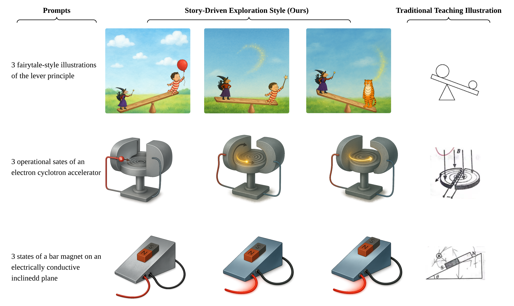

# LEARN: Layout‑Enabled Automatic Rendering of Narratives for STEM Education (ICONIP2025)

<a href='https:/'></a> 


## 📌News
[2025.7.25] - 🧨Accepted by ICONIP2025 Conference 
[2024.8.21] - 🧨Finished the bookcover db for STEM GenAI 


## ⏰TODOs
- [ ] Release the model and inference code
- [x] Provide publicly accessible result
- [ ] Provide samples of result
- [ ] Release tools for merging weights from community models or LoRAs
- [ ] Release LEARN-benchmark evaluation code
- [ ] Release LEARN training code
>>>>>>> origin/main

## Citation

If you find LEARN useful for your research and applications, please cite using this BibTeX:
```bibtex
@inproceedings{
maoquan2025learn,
title={{LEARN}: A Story-Driven Layout-to-Image Generation Framework for {STEM} Instruction},
author={Zhang Maoquan and Bisser Raytchev and Sun Xiujuan},
booktitle={32nd International Conference on Neural Information Processing},
year={2025},
url={https://openreview.net/forum?id=oRLHf13ZOy}
}
```
